En esta ocasión resolveremos el laboratorio -> **Meerkat**.

Luego de extraer el archivo comprimido, abrimos Wireshark:

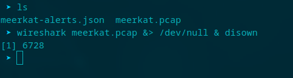

Pregunta 1:

Creemos que nuestro servidor de la Plataforma de Gestión Empresarial ha sido comprometido. ¿Podría confirmar el nombre de la aplicación que se está ejecutando?

Para facilitar el análisis, exportamos todos los logs a Splunk:

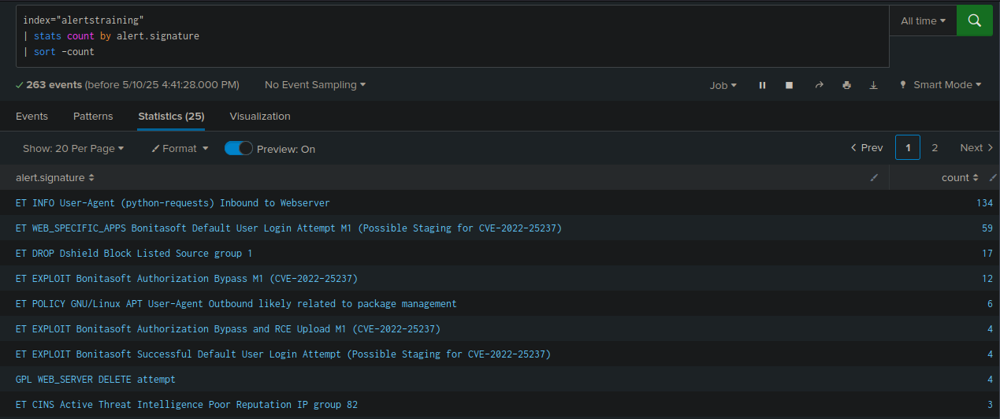

Observamos que el servidor ejecuta la aplicación web **Bonita**.

Pregunta 2: 

Creemos que el atacante puede haber utilizado un subconjunto de la categoría de ataque de fuerza bruta: ¿cómo se llama el ataque realizado?

Filtrando tráfico HTTP en Wireshark, observamos conversaciones sospechosas por TCP:

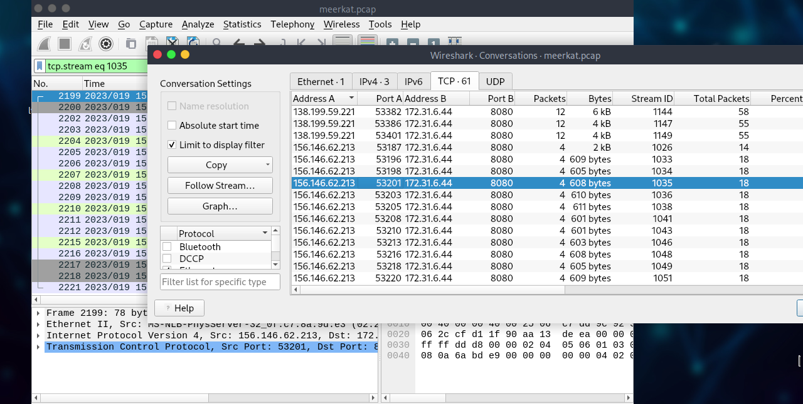

Usamos la opción 'Follow Stream'

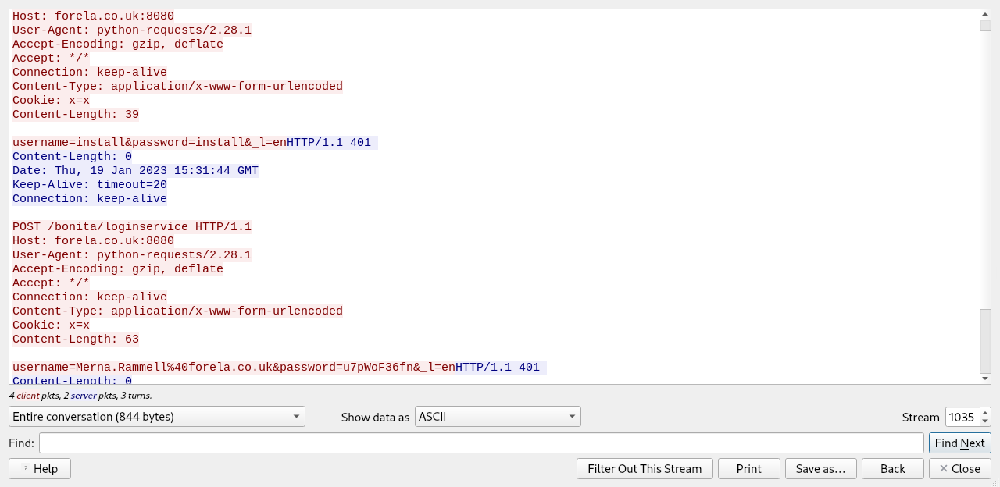

Vemos claramente una actividad maliciosa, vamos a filtrar por la IP, y User-Agent

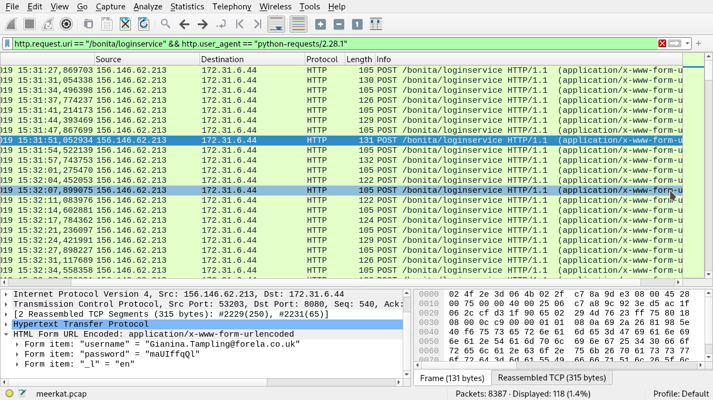

Tras analizar las solicitudes HTTP y las credenciales utilizadas, consultando MITRE ATT&CK se puede concluir que el ataque corresponde a la técnica conocida como **Credential Stuffing**. Este tipo de ataque automatizado consiste en reutilizar combinaciones de nombres de usuario y contraseñas obtenidas de filtraciones previas, con el objetivo de acceder a otros servicios. En este caso, la evidencia sugiere que el atacante apunta a usuarios válidos, utilizando credenciales específicas por usuario, lo que descarta un ataque de fuerza bruta convencional en el que se prueban contraseñas al azar.

Pregunta 3:

¿La vulnerabilidad explotada tiene un CVE asignado? Y si es así, ¿cuál?

Se realizó una búsqueda en Splunk para identificar las alertas relacionadas con vulnerabilidades CVE, utilizando el comando `alert.signature=*CVE*`. Esto permite filtrar las alertas que contienen referencias a vulnerabilidades conocidas, eliminar duplicados con `dedup`, y mostrar solo las firmas únicas en una tabla para facilitar el análisis.

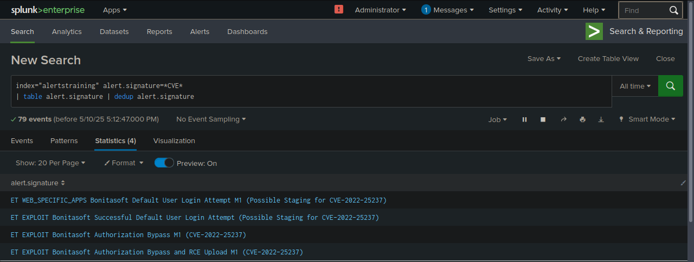

Pregunta 4:

¿Qué cadena se añadió a la ruta URL de la API para evitar el filtro de autorización mediante el exploit del atacante?

En este caso tendremos que investigar el CVE previo.

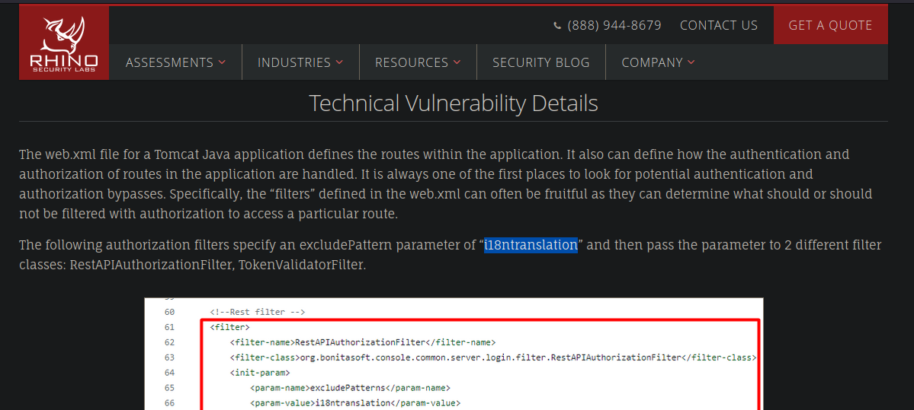

Parece ser que la cadena `i18ntranslation` fue agregada a la ruta de la API para evadir los filtros de autorización, ya que en el archivo `web.xml` está definida como una excepción dentro de los filtros `RestAPIAuthorizationFilter` y `TokenValidatorFilter`, permitiendo así el acceso sin autenticación.

Podemos visualizarlo en wireshark

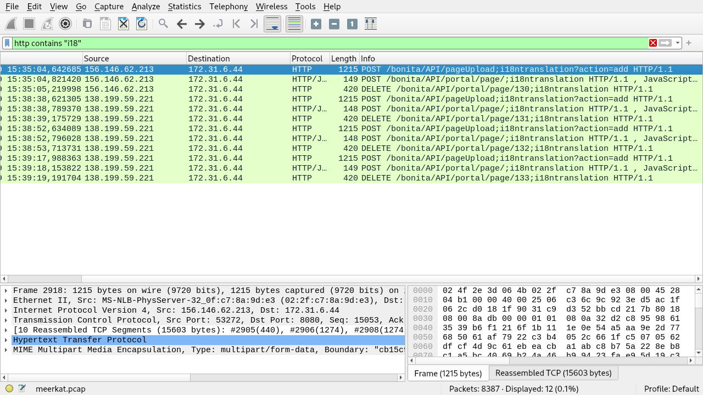

Pregunta 5:

¿Cuántas combinaciones de nombres de usuario y contraseñas se utilizaron en el ataque de robo de credenciales?

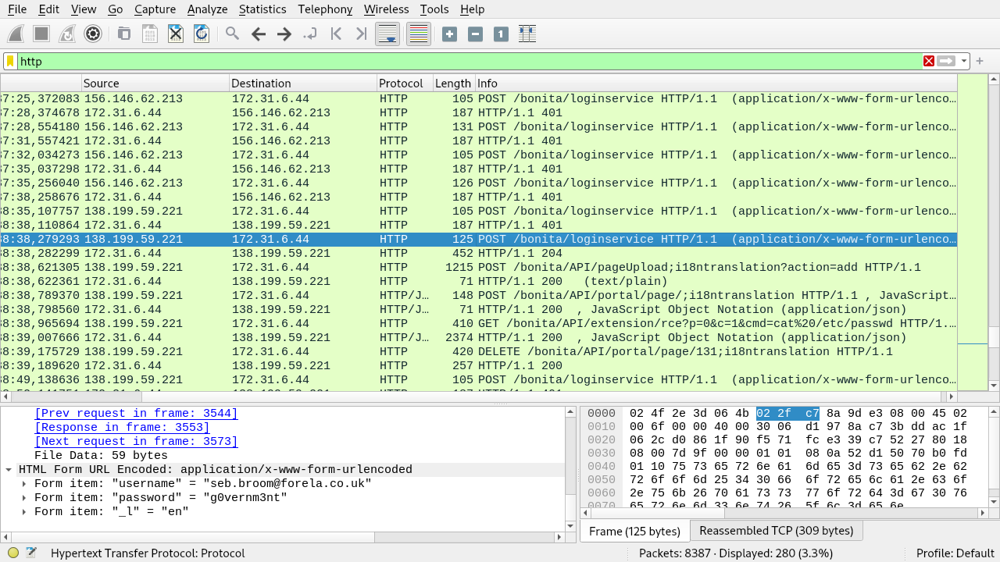

Filtrando el tráfico HTTP por solicitudes POST, se observan múltiples intentos de autenticación hacia el endpoint de login. Analizando los datos dentro de esas solicitudes, podemos estimar que se probaron 56 combinaciones distintas de usuario y contraseña durante el ataque.

Pregunta 6: 

¿Qué combinación de nombre de usuario y contraseña fue exitosa?

Filtrando solicitudes POST a la ruta de login del servidor, y viendo las conversaciones, vemos que el total de paquetes de la mayoría de solicitudes es de 18, y todos dan un codigo de estado 401, Unauthorized, por lo cual pondremos nuestra atención las primeras solicitudes

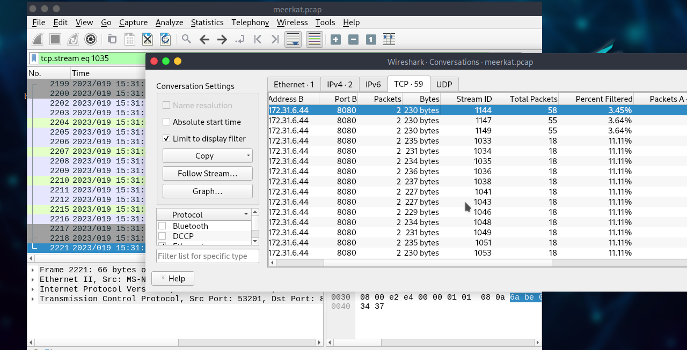

Vamos a la opción Follow Stream, y observamos las credenciales junto con un código de estado HTTP 204, lo que confirma el acceso exitoso

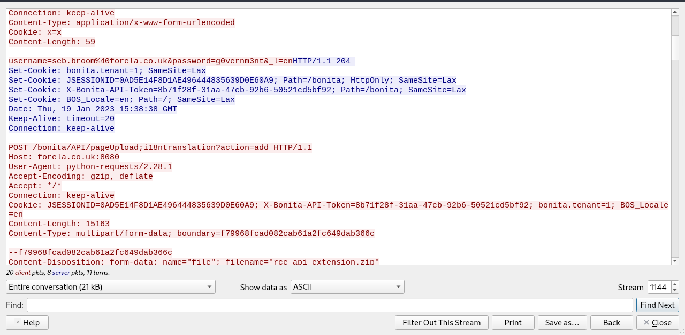

Pregunta 7: 

¿qué sitio para compartir texto utilizó el atacante?

Nos vamos a Statistics > HTTP > Request, de esta manera visualizaremos de manera mas comoda las solicitudes web

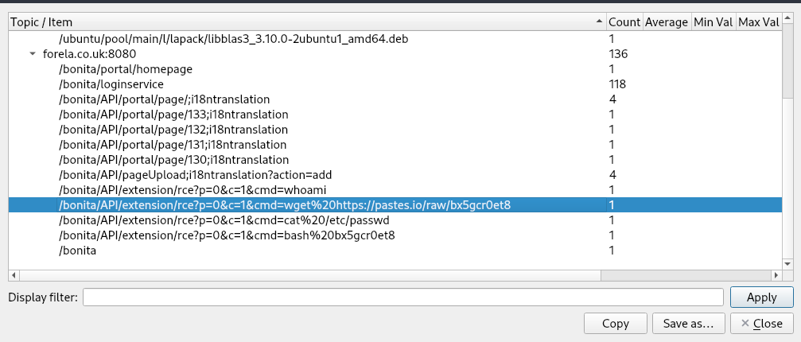

El atacante exfiltró información del sistema comprometido y la compartió públicamente a través del sitio `pastes.io`, un servicio comúnmente usado para compartir texto de forma rápida y anónima.

Pregunta 8:

Proporcione el nombre de archivo de la clave pública utilizada por el atacante para obtener persistencia en nuestro host.

Se realiza una petición curl al recurso, vemos el nombre del archivo "hffgra4unv"

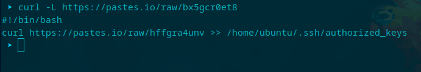

Pregunta 9:

¿Puedes confirmar el archivo modificado por el atacante para ganar persistencia?

en la captura de arriba podemos visualizar también la ruta modificada: /home/ubuntu/.ssh/authorized_keys

Pregunta 10:

¿Puede confirmar el ID de la técnica MITRE de este tipo de mecanismo de persistencia?

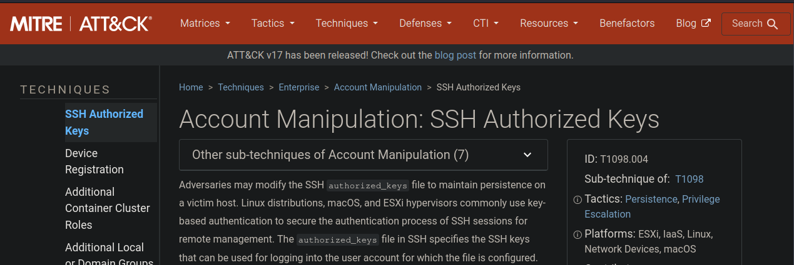

MITRE ATT&CK otorga el ID T1098.004 para este tipo de persistencia

