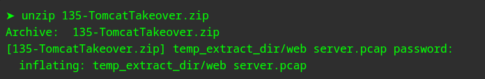
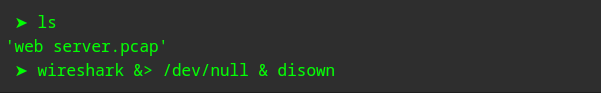
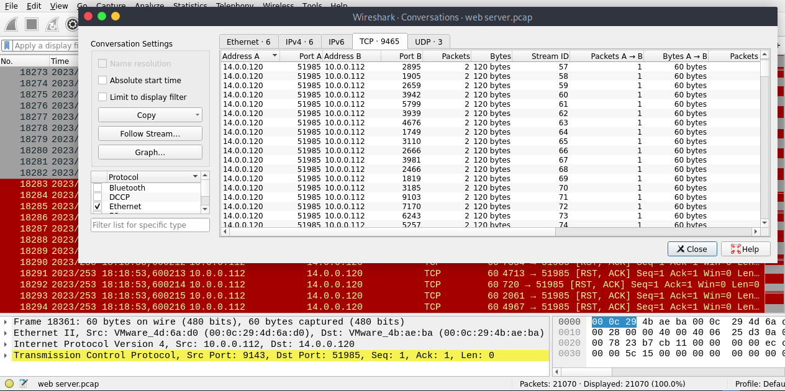
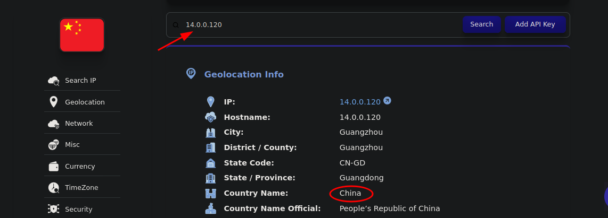
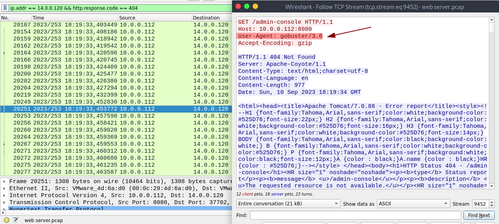
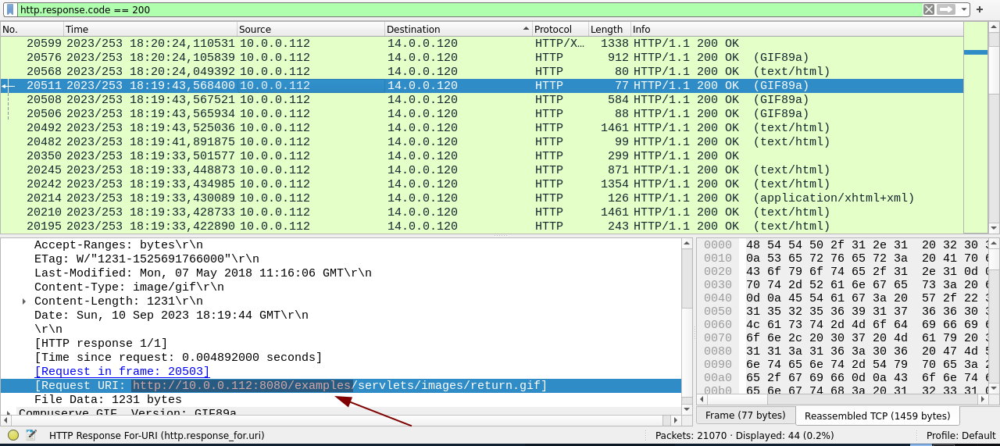
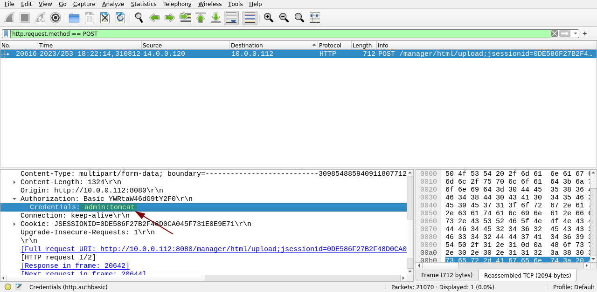
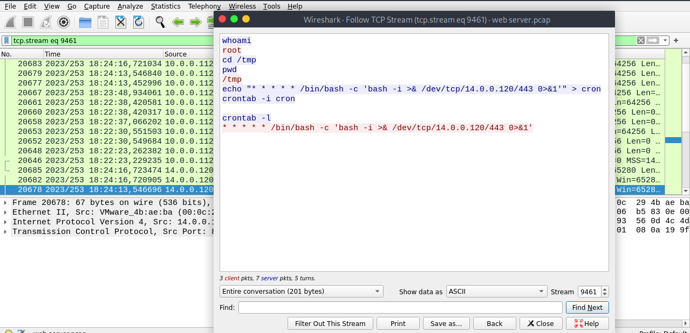

En esta ocasion resolveremos el laboratorio -> Tomcat Takeover Lab

empezamos extrayendo el comprimido, con la contraseña proporcionada



nos deja un archivo pcap, por lo cual lo analizamos con wireshark




Q1: Dada la actividad sospechosa detectada en el servidor web, el archivo PCAP revela una serie de solicitudes en varios puertos, lo que indica un posible comportamiento de escaneo. ¿Puede identificar la dirección IP de origen responsable de iniciar estas solicitudes en nuestro servidor?


Si nos vamos a "Conversations" en Wireshark podemos indentificar facilmente como la ip del atacante es --> 14.0.0.120  el cual ejecuta un escaneo por tcp a multiples puertos del host 10.0.0.112 



-------------------


Q2: Según la dirección IP identificada asociada con el atacante, ¿puede identificar al país desde el cual se originaron las actividades del atacante?

al investigar la IP nos muestra que Proviene de China



--------------------

Q3: Entre los diversos puertos abiertos detectados durante el escaneo, uno proporciona acceso al panel administrativo del servidor web. ¿Qué número de puerto corresponde al panel de administración?

si filtramos por el trafico http y la IP del atacante en Wireshark podremos ver que se accede a la ruta '/Manager' la cual es por defecto el panel de administracion del servidor Tomcat, alojada en el Puerto: 8080


--------------

Q4: Después del descubrimiento de puertos abiertos en nuestro servidor, parece que el atacante intentó enumerar y descubrir directorios y archivos en nuestro servidor web. ¿Qué herramientas puede identificar del análisis que ayudó al atacante en este proceso de enumeración?


Filtrando por la IP del atacante y por codigos de estado 404, veremos multiples solicitudes por fuerza bruta, a directorios que no existen. nos vamos a Follow TCP Stream, y miramos el user-agent, el cual no fue alterado y revela el uso de la herramienta gobuster



----------


Q5: Después del esfuerzo por enumerar los directorios en nuestro servidor web, el atacante realizó numerosas solicitudes para identificar interfaces administrativas. ¿Qué directorio específico relacionado con el panel de administración descubrió el atacante?


En este caso filtraremos por codigos de respuesta 200, si analizamos, podremos ver que el atacante accede a la ruta '/Manager' la cual como dijimos anteriormente, sabemos que es la ruta del panel de administración.




----------

Q6: Después de acceder al panel de administración, el atacante intentó hacer fuerza bruta a las credenciales de inicio de sesión. ¿Puede determinar el nombre de usuario y la contraseña correctos que el atacante usó con éxito para iniciar sesión?


Para determinar las credenciales de acceso, tendremos que filtrar por: ```http.request.method == POST``` 
`POST` es uno de los **métodos HTTP** usados para enviar datos desde el cliente (como un navegador o herramienta) al servidor. Una vez aplicado el filtro podremos ver las credenciales  admin:tomcat



--------------

Q7: Una vez dentro del panel de administración, el atacante intentó cargar un archivo con la intención de establecer un shell inverso. ¿Puede identificar el nombre de este archivo malicioso?


En el mismo paquete, veremos el archivo que se sube un archivo con el nombre: "JXQOZY.war"


-----------

Q8: Después de establecer con éxito un shell inverso en nuestro servidor, el atacante tuvo como objetivo garantizar la persistencia en la máquina comprometida. Del análisis, ¿puede determinar el comando específico que están programados para ejecutar para mantener su presencia?

Podremos ver mediante TCP Stream, que la siguiente acción del atacante es acceder a este recurso, el cual el contenido es una típica reverse shell de bash


